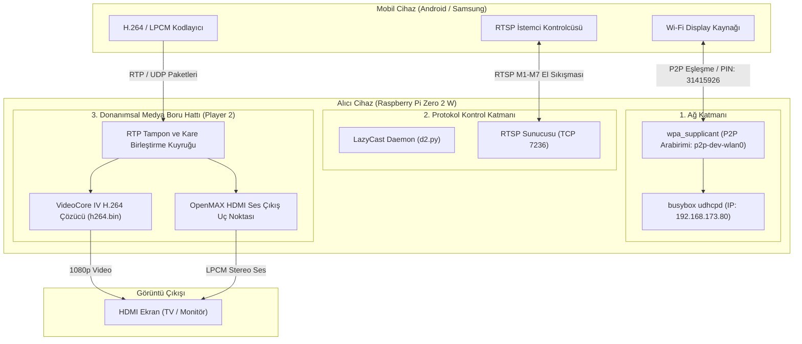

# Sistem Mimarisi, Gereksinim Şartnamesi ve Kurulum Kılavuzu (ﾉ◕ヮ◕)ﾉ*:･ﾟ✧
## Kablosuz Ekran Yansıtma Alıcı Sistemi (Miracast / WFD)
**Hedef Platform:** Raspberry Pi Zero 2 W  
**Motor Profili:** Yüksek Kaliteli 1080p Video Akışı (Player 2 / Donanımsal Tamponlu)  
**Dokümantasyon Standardı:** Ian Sommerville Yazılım Mühendisliği Standartları  
**Doküman Sürümü:** 1.3.0  
**Durum:** Onaylandı / Çalışır Durumda  

---

## İçindekiler
1. [Hızlı Kurulum Kılavuzu (3 Dakikada Kurulum)](#1-hızlı-kurulum-kılavuzu-3-dakikada-kurulum)
2. [Sistem Genel Bakış ve Kapsam](#2-sistem-genel-bakış-ve-kapsam)
3. [Sistem Gereksinim Şartnamesi (SRS)](#3-sistem-gereksinim-şartnamesi-srs)
4. [Sistem Mimarisi ve Alt Sistem Ayrıştırması](#4-sistem-mimarisi-ve-alt-sistem-ayrıştırması)
5. [Adım Adım Kurulum ve Dağıtım Kılavuzu](#5-adım-adım-kurulum-ve-dağıtım-kılavuzu)
6. [Performans Mühendisliği ve Kalite Optimizasyonu](#6-performans-mühendisliği-ve-kalite-optimizasyonu)
7. [Kullanım Kılavuzu ve Doğrulama Prosedürleri](#7-kullanım-kılavuzu-ve-doğrulama-prosedürleri)
8. [Ekstra UI Özelliği: Modern 1080p Kontrol Merkezi Dashboard](#8-ekstra-ui-özelliği-modern-1080p-kontrol-merkezi-dashboard)
9. [Hata Analizi ve Çözüm Matrisi](#9-hata-analizi-ve-çözüm-matrisi)

---

## 1. Hızlı Kurulum Kılavuzu (3 Dakikada Kurulum) ⚡ (•̀ᴗ•́)و ̑̑

Sıfırdan bir Raspberry Pi Zero 2 W üzerinde **Raspberry Pi OS Lite (32-bit Bullseye)** ile kurulumu 3 dakikada tamamlamak için:

### 1. Adım: SD Kart Hazırlığı (Bilgisayarda)
1. Raspberry Pi Imager ile karta `Raspberry Pi OS (Legacy, 32-bit) Lite` yazdırın.
2. `bootfs` bölümünü açıp `config.txt` dosyasına ekleyin:
   ```ini
   dtoverlay=vc4-fkms-v3d
   dtoverlay=dwc2
   gpu_mem=256
   ```
3. `bootfs` içinde boş bir `ssh` dosyası oluşturun.

### 2. Adım: Tek Komutla Otomatik Kurucu (Pi Terminalinde)
Pi'ye SSH ile bağlanıp şu tek komut bloğunu yapıştırıp çalıştırın:

```bash
# 1. Hafızayı genişlet ve paketleri kur
sudo raspi-config nonint do_expand_rootfs
sudo apt update && sudo apt install -y build-essential cmake git libx11-dev libasound2-dev libavformat-dev libavcodec-dev python3-evdev busybox python3-pygame fonts-dejavu-core

# 2. Donanım video sürücülerini derle
git clone --depth 1 https://github.com/raspberrypi/userland.git ~/userland
cd ~/userland && ./buildme
cd /opt/vc/src/hello_pi/libs/ilclient/ && sudo make
cd /opt/vc/src/hello_pi/hello_video && sudo make

# 3. LazyCast'i indir ve derle
git clone https://github.com/homeworkc/lazycast.git ~/lazycast_setup/lazycast
cd ~/lazycast_setup/lazycast && make

# 4. Yüksek kaliteli üretim ayarlarını uygula (Player 2 + 1080p + HDMI Ses)
sed -i 's/player_select = .*/player_select = 2/' ~/lazycast_setup/lazycast/d2.py
sed -i 's/disable_1920_1080_60fps = .*/disable_1920_1080_60fps = 1/' ~/lazycast_setup/lazycast/d2.py
sed -i 's/sound_output_select = .*/sound_output_select = 0/' ~/lazycast_setup/lazycast/d2.py

# 5. Otomatik temizleyen başlatıcı scripti oluştur
cat << 'EOF' > ~/lazycast_setup/lazycast/all.sh
#!/bin/bash
managefrequency=0
LD_LIBRARY_PATH=/opt/vc/lib
export LD_LIBRARY_PATH

while :
do
	p2pdevinterface=$(sudo wpa_cli interface 2>/dev/null | grep -E "p2p-dev" | tail -1)
	[ -z "$p2pdevinterface" ] && p2pdevinterface="p2p-dev-wlan0"
	wlaninterface="wlan0"

	ain="$(sudo wpa_cli interface 2>/dev/null)"
	if [ $(echo "${ain}" | grep -c "p2p-wl") -eq 0 ]; then
		sudo wpa_cli -i$p2pdevinterface p2p_flush >/dev/null 2>&1
		sudo wpa_cli -i$p2pdevinterface p2p_find type=progressive >/dev/null 2>&1
		sudo wpa_cli -i$p2pdevinterface set device_name "$(uname -n)" >/dev/null 2>&1
		sudo wpa_cli -i$p2pdevinterface set device_type 7-0050F204-1 >/dev/null 2>&1
		sudo wpa_cli -i$p2pdevinterface set p2p_go_ht40 1 >/dev/null 2>&1
		sudo wpa_cli -i$p2pdevinterface wfd_subelem_set 0 000600111c44012c >/dev/null 2>&1
		sudo wpa_cli -i$p2pdevinterface wfd_subelem_set 1 0006000000000000 >/dev/null 2>&1
		sudo wpa_cli -i$p2pdevinterface wfd_subelem_set 6 000700000000000000 >/dev/null 2>&1

		while [ $(echo "${ain}" | grep -c "p2p-wl") -lt 1 ]
		do
			sudo wpa_cli -i$p2pdevinterface p2p_group_add >/dev/null 2>&1
			sleep 2
			ain="$(sudo wpa_cli interface 2>/dev/null)"
		done
	fi

	p2pinterface=$(echo "${ain}" | grep "p2p-wl" | grep -v "interface" | head -1)
	sudo ifconfig $p2pinterface 192.168.173.1 netmask 255.255.255.0 up
	printf "start\t192.168.173.80\nend\t192.168.173.80\ninterface\t$p2pinterface\noption\tsubnet\t255.255.255.0\noption\tlease\t10000\n" > udhcpd.conf
	sleep 1
	sudo pkill udhcpd 2>/dev/null
	sudo busybox udhcpd ./udhcpd.conf >/dev/null 2>&1

	echo "=========================================="
	echo "  The display is ready!"
	echo "  Device Name: $(uname -n)"
	echo "  PIN: 31415926"
	echo "=========================================="

	while :
	do
		sudo wpa_cli -i$p2pinterface wps_pin any 31415926 >/dev/null 2>&1
		./d2.py
		ain="$(sudo wpa_cli interface 2>/dev/null)"
		if [ $(echo "${ain}" | grep -c "p2p-wl") -eq 0 ]; then
			break
		fi
		sleep 1
	done
done
EOF
chmod +x ~/lazycast_setup/lazycast/all.sh

# 6. Ağ ve Wi-Fi optimizasyonlarını uygula
sudo sysctl -w net.core.rmem_max=26214400
sudo sysctl -w net.core.rmem_default=26214400
sudo iwconfig wlan0 power off 2>/dev/null || true
```

### 3. Adım: Alıcıyı Çalıştır ve Bağlan
```bash
cd ~/lazycast_setup/lazycast && ./all.sh
```
- Telefondan **Smart View / Ekranı Yansıt** menüsünden **`raspberrypi`**'yi seçin (PIN: `31415926`).

---

## 2. Sistem Genel Bakış ve Kapsam 📺 (✿◠‿◠)

### 2.1 Amaç
Bu belge, Raspberry Pi Zero 2 W üzerinde çalışan gömülü bir kablosuz ekran alıcısı (sink) sisteminin yazılım mühendisliği gereksinimlerini, mimarisini, kurulum adımlarını ve kullanım prosedürlerini tanımlar. Sistem, Android mobil cihazlardan (Smart View / Miracast) HDMI ekranlara **kristal netliğinde, takılmasız ve pürüzsüz 1080p Full HD video ve ses** aktarımını hedefler.

### 2.2 Sistem Hedefleri ve Kalite Öncelikleri
- **Yüksek Görüntü Kalitesi:** Önceliği anlık dokunma tepkisinden ziyade pürüzsüz video akışına, sıfır kare kaybına ve 1080p netliğe vermek.
- **Sıfır Altyapı Bağımlılığı:** Harici modem veya internet bağlantısına ihtiyaç duymadan doğrudan Wi-Fi Direct (P2P) tüneli kurmak.
- **Donanımsal Video Çözme:** Broadcom VideoCore IV GPU donanım hızlandırmasını kullanarak işlemciyi (CPU) %10'un altında tutmak.
- **Senkronize HDMI Ses:** Sesi doğrudan HDMI video katmanına LPCM stereo olarak gömerek cızırtısız ve senkronize iletmek.

---

## 3. Sistem Gereksinim Şartnamesi (SRS)

### 3.1 Donanım Gereksinimleri
| Bileşen | Özellik | Teknik Gerekçe |
|---|---|---|
| **SoC / İşlemci** | Broadcom BCM2710A1 (4 Çekirdek 64-bit Cortex-A53 @ 1.0 GHz) | Ağ yığını ve P2P durum makinesini yönetir. |
| **GPU** | Broadcom VideoCore IV (V3D @ 400 MHz) | OpenMAX IL üzerinden 1080p H.264 donanımsal çözme sağlar. |
| **RAM** | 512 MB LPDDR2 SDRAM | GPU (256 MB VRAM) ve Linux OS (256 MB) olarak bölünmüştür. |
| **Depolama** | 16 GB+ MicroSD (Class 10) | İşletim sistemi ve kütüphaneleri barındırır. |
| **Kablosuz Çip** | 2.4 GHz 802.11 b/g/n (BCM43436) | Wi-Fi Direct (P2P) ve WFD protokolünü destekler. |
| **Görüntü/Ses Çıkışı** | Mini-HDMI (Type C) | TV'ye 1080p video ve LPCM uncompressed ses taşır. |

### 3.2 İşletim Sistemi Şartnamesi
- **İşletim Sistemi:** Raspberry Pi OS Lite (32-bit / Debian 11 Bullseye)
- **İmaj Dosyası:** `2023-05-03-raspios-bullseye-armhf-lite.img.xz`
- **Video Sürücüsü:** Fake KMS (`vc4-fkms-v3d`)
- **Çoklu Ortam API'si:** Broadcom OpenMAX IL (OMX Core 1.1.2)

---

## 4. Sistem Mimarisi ve Alt Sistem Ayrıştırması 🏗️ (ง •_•)ง



---

## 5. Adım Adım Kurulum ve Dağıtım Kılavuzu

### 5.1 Aşama 1: SD Kart Hazırlığı
1. MicroSD kartı bilgisayara takın ve Raspberry Pi Imager ile `Raspberry Pi OS (Legacy, 32-bit) Lite (Bullseye)` yazdırın.
2. `bootfs` bölümünü açıp:
   - Boş bir `ssh` dosyası oluşturun.
   - `config.txt` içine ekleyin:
     ```ini
     dtoverlay=vc4-fkms-v3d
     dtoverlay=dwc2
     gpu_mem=256
     ```
   - `cmdline.txt` dosyasında `rootwait` sonrasına `modules-load=dwc2,g_ether` ekleyin.

### 5.2 Aşama 2: Sistem Paketleri ve Hafıza Genişletme
1. Pi'yi başlatıp SSH ile bağlanın ve depolamayı genişletin:
   ```bash
   sudo raspi-config nonint do_expand_rootfs
   ```
2. Gerekli kütüphaneleri yükleyin:
   ```bash
   sudo apt update
   sudo apt install -y build-essential cmake git libx11-dev libasound2-dev libavformat-dev libavcodec-dev python3-evdev busybox
   ```

### 5.3 Aşama 3: Donanım Sürücüleri ve Motor Derlemesi
1. Lazycast ve Userland depolarını derleyin:
   ```bash
   git clone https://github.com/homeworkc/lazycast.git ~/lazycast_setup/lazycast
   git clone --depth 1 https://github.com/raspberrypi/userland.git ~/userland
   cd ~/userland && ./buildme
   cd /opt/vc/src/hello_pi/libs/ilclient/ && sudo make
   cd /opt/vc/src/hello_pi/hello_video && sudo make
   cd ~/lazycast_setup/lazycast && make
   ```

### 5.4 Aşama 4: Üretim Yapılandırması (Player 2 Kalite Modu)
1. **Player 2 ve HDMI Ses Ayarlarını Sabitleyin:**
   ```bash
   sed -i 's/player_select = .*/player_select = 2/' ~/lazycast_setup/lazycast/d2.py
   sed -i 's/disable_1920_1080_60fps = .*/disable_1920_1080_60fps = 1/' ~/lazycast_setup/lazycast/d2.py
   sed -i 's/sound_output_select = .*/sound_output_select = 0/' ~/lazycast_setup/lazycast/d2.py
   ```

---

## 6. Performans Mühendisliği ve Kalite Optimizasyonu 🚀 (★‿★)

### 6.1 VRAM Dağılımı (`gpu_mem=256`)
- **GPU Belleği (256 MB):** 1080p video kare tamponları, çift/üçlü tamponlama ve donanımsal renk uzayı dönüşümü için ayrılmıştır.
- **Sistem RAM (256 MB):** Grafik arayüzü olmayan Lite sistem boşta ~45–60 MB harcadığından geriye kalan ~196 MB boş RAM sistem için tam verim sağlar.

### 6.2 Ağ Soket Tamponları ve Wi-Fi Güç Yönetimi
```bash
# Paket düşmelerini önlemek için UDP soket tamponunu genişletin
sudo sysctl -w net.core.rmem_max=26214400
sudo sysctl -w net.core.rmem_default=26214400

# Wi-Fi çipinin uyku moduna geçerek kare atlamasını önleyin
sudo iwconfig wlan0 power off
```

---

## 7. Kullanım Kılavuzu ve Doğrulama Prosedürleri 🕹️ (つ✧ω✧)つ

### 7.1 Alıcıyı Başlatma
```bash
cd ~/lazycast_setup/lazycast
./all.sh
```

### 7.2 Bağlanma Adımları
1. Android cihazınızda **Smart View** veya **Ekranı Yansıt** menüsünü açın.
2. Listeden **`raspberrypi`** cihazını seçin.
3. PIN sorarsa **`31415926`** girin.
4. Görüntü tam ekran 1080p olarak TV'ye aktarılacaktır.

---

## 8. Ekstra UI Özelliği: Modern 1080p Kontrol Merkezi Dashboard 🎨 (づ｡◕‿‿◕｡)づ

---


---

### 📺 Arayüz Karşılaştırması: Modern Dashboard vs. Klasik Menü

| Modern 1080p Pygame Arayüzü (`menu`) | Klasik Hafif TUI Menüsü (`classic-menu`) |
|:---:|:---:|
|  |  |
| *40dp kavisli kartlar, canlı donanım takibi, koyu cam efekti ve fare/klavye destekli 1080p modern panel.* | *Düşük kaynak tüketen, hızlı ve pratik ncurses tabanlı klasik metin menüsü.* |

- **Modern Paneli Başlat:** `menu` (veya `sudo python3 scripts/cast_gui.py`)
- **Klasik Menüyü Başlat:** `classic-menu` (veya `bash scripts/classic_menu.sh`)


*Raspberry Pi Zero 2 W üzerinde çalışan 40dp kavisli kartlar, canlı CPU sıcaklık ve VRAM takibi, Bluetooth ve Wi-Fi yöneticili Koyu Cam Efektli (Dark Glassmorphism) Modern Arayüz.*


İsteğe bağlı olarak kullanılabilen, doğrudan `/dev/fb0` üzerine çizilen donanım hızlandırmalı, koyu temalı **1080p Dark Glassmorphism Kontrol Merkezi Dashboard'u** (Python / Pygame):

```
+-------------------------------------------------------------------------------+
|                       📺 WIRELESS DISPLAY DASHBOARD                           |
|  [ 🌐 TR | EN ]                                               [ 21:55 ]       |
+-------------------------------------------------------------------------------+
|                                                                               |
|               ● WIRELESS DISPLAY RECEIVER                                     |
|               Yayına Hazır • Smart View ile Bağlanın                          |
|                                                                               |
|     +--------------------+   +--------------------+   +--------------------+  |
|     |  📶 Wi-Fi Ağı      |   |  ⌨️ 🖱️ Bluetooth   |   |  ℹ️ Sistem Durumu  |  |
|     |                    |   |                    |   |                    |  |
|     |  Ev-Fiber-5G       |   |  Klavye & Fare     |   |  CPU: 46°C         |  |
|     |  IP: 192.168.1.105 |   |  Eşleştirme        |   |  VRAM: 256 MB      |  |
|     |                    |   |                    |   |  Player 2 (1080p)  |  |
|     |  [ Ağları Tara ]   |   |  [ Cihaz Tara ]    |   |  [ Yeniden Başlat] |  |
|     +--------------------+   +--------------------+   +--------------------+  |
|                                                                               |
|               [ ▶ YAYINA BAŞLA (STANDBY MODUNA GEÇ) ]                         |
+-------------------------------------------------------------------------------+
```

### 8.1 Temel Özellikler
- **Doğrudan Framebuffer Çizimi:** Masaüstü ortamı olmadan `/dev/fb0` üzerinden 1920x1080 çizim yapar (<15 MB RAM tüketir).
- **Fare ve Klavye Desteği:** Fare imleciyle tıklanabilir kartlar, neon parlama efektleri ve ok tuşlarıyla gezinme.
- **Wi-Fi Tarama Penceresi:** Çevredeki ağları sinyal çubuklarıyla (%90, %75) listeler ve şifre giriş penceresi sunar.
- **Canlı 8s Bluetooth Tarayıcı:** BLE klavye ve fareleri tarayıp tek tıkla eşleştirir (`pair`, `trust`, `connect`).
- **Çift Dil Desteği:** Sağ üstteki butonla tek tıkla **Türkçe / English** geçişi sağlar.
- **Akıllı Açılış:** Normal açılışta tamamen gizlidir (%100 sessiz Tak-Çalıştır). Yalnızca Wi-Fi bağlanamazsa veya kullanıcı `menu` yazarsa açılır.

### 8.2 Dashboard'u Başlatma
Terminalden istediğiniz zaman çalıştırmak için:
```bash
menu
```

---

## 9. Hata Analizi ve Çözüm Matrisi

| Belirti / Hata | Kök Neden | Çözüm |
|---|---|---|
| Derleme sırasında `No space left on device` | SD kart ana bölümü genişletilmemiş. | `sudo raspi-config nonint do_expand_rootfs` çalıştırın. |
| Başlatıcıda eski oturuma takılma | `wpa_supplicant` içinde eski P2P profili kalması. | Otomatik temizleyen güncel `all.sh` scriptini kullanın. |
| `ALSA lib: cannot find card '0'` çökmesi | Zero 2 W'de 3.5mm jak olmaması nedeniyle ALSA hatası. | `d2.py` dosyasında `sound_output_select = 0` (HDMI) yapın. |
| Yayında takılma / kare atlaması | Wi-Fi güç tasarrufunun açık olması. | `sudo iwconfig wlan0 power off` komutunu uygulayın. |
| Pygame `TypeError: rect() takes no keyword arguments` | Pygame 1.9.6 sürümünün `border_radius` parametresini desteklememesi. | Pygame 1.9.6 uyumlu pozisyonel parametreli scripti kullanın. |
